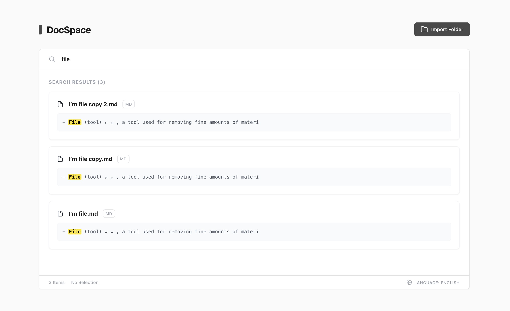

# English

# DocSpace

DocSpace is a pure front-end local document search tool.  
It is distributed as a single HTML file and can be used directly in a web browser.

No installation, no build step, and no backend service are required.

## Features

- Local folder import
- Full-text keyword search
- Highlighted search results with context snippets
- File preview and download
- File selection and batch removal
- Multilingual interface (Chinese / English / Japanese)

All file contents are processed in memory and never uploaded or persisted.

## Usage

Open the HTML file directly in a web browser.

Chromium-based browsers such as Chrome or Edge are recommended.

## Notes

- All search logic runs entirely in the browser; performance depends on file size and quantity
- Dependencies are loaded via CDN; an internet connection is required on first load
- This tool does not modify or affect original local files

## License

MIT

# 中文版
# DocSpace

DocSpace 是一个纯前端的本地文档搜索工具。  
项目以单个 HTML 文件形式存在，可直接在浏览器中打开使用。

无需安装、无需构建、无需后端服务。

## 功能

- 本地文件夹导入
- 文本内容关键词搜索
- 搜索结果高亮与上下文展示
- 文件预览与下载
- 文件选择与批量移除
- 中 / 英 / 日多语言界面

文件内容仅存在于浏览器内存中，不会上传或持久化存储。

## 使用方式

直接用浏览器打开 HTML 文件即可。

建议使用 Chrome / Edge 等 Chromium 内核浏览器。

## 说明

- 搜索逻辑完全在前端执行，文件规模较大时性能取决于浏览器
- 页面通过 CDN 加载依赖，首次打开需要网络连接
- 不会对本地原始文件造成任何修改

## License

MIT
